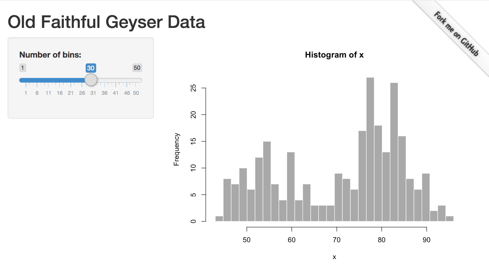

ribbon
================

Include useful ribbons in your Shiny applications and R Markdown
documents quickly and easily with the `ribbon` package\!

For example,

``` r
# note that this does not actually work for markdown documents
ribbon_github("https://github.com/colearendt/ribbon")
```



### Getting Started

The package is not currently on CRAN, so you can install the latest
with:

``` r
devtools::install_github("colearendt/ribbon")
```
