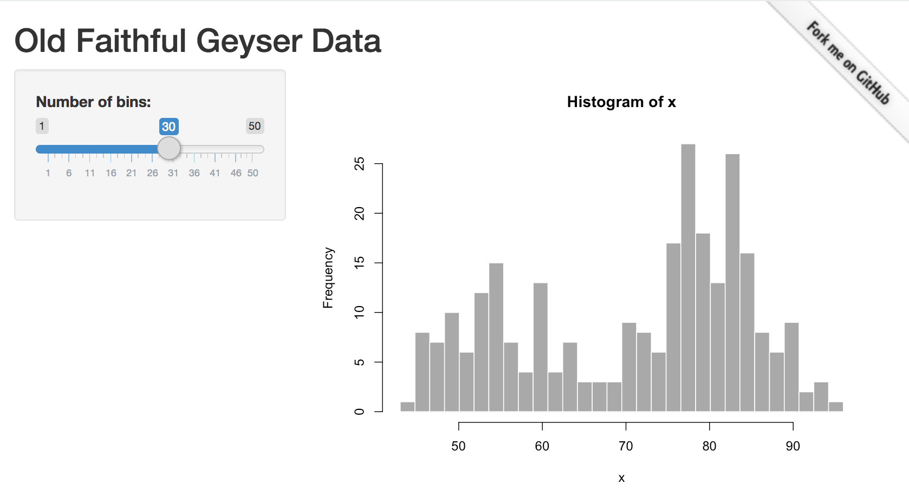

gitlink
================

[](https://travis-ci.org/colearendt/gitlink)
[](https://ci.appveyor.com/project/colearendt/gitlink)
[](https://codecov.io/github/colearendt/gitlink?branch=master)

Include useful GitHub links in your Shiny applications and R Markdown
documents quickly and easily with the `gitlink` package\!

For example,

``` r
# note that this does not actually work for pure markdown documents like this README
ribbon_css("https://github.com/colearendt/gitlink")
```



### Getting Started

The package can be installed from CRAN:

```r
install.packages("gitlink")
```

Or you can install the latest development version with:

``` r
devtools::install_github("colearendt/gitlink")
```

The `ribbon_css` function is highly customizable, as you can set any color, font, font-size,
or other CSS properties with the parameters provided.

For example:

```r
  ribbon_css("mylink.com", position = "left")
  ribbon_css("mylink.com", color = "black", font_color = "white", border_color = "white")
  ribbon_css("mylink.com", text = "Fork me PLEASE", fade = FALSE)
```

For more advanced examples, see `?ribbon_css`

# Code of Conduct

Please note that the 'gitlink' project is released with a [Contributor Code of
Conduct](https://github.com/colearendt/gitlink/blob/master/.github/CODE_OF_CONDUCT.md).
By contributing to this project, you agree to abide by its terms.

# Other Musings

Some interesting links that we have stumbled upon in our travels. Perhaps
interesting for future or related work:

- https://buttons.github.io/
- https://github.com/tholman/github-corners/
- http://code.danyork.com/2011/09/29/how-to-create-github-style-fork-me-ribbons-using-only-css/
- https://unindented.org/articles/github-ribbon-using-css-transforms/
- https://ghbtns.com/
